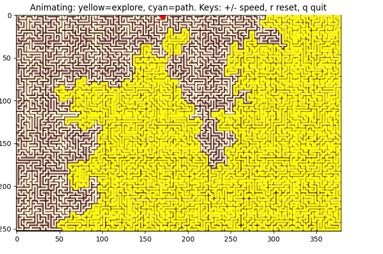

# A* Pathfinding Visualizer on Maps

An interactive pathfinding tool that uses the **A*** algorithm to find routes across black-and-white map images. This project demonstrates pathfinding concepts with a visual interface, allowing users to select start and goal points and see the algorithm’s exploration process in real time.

---

## Features

- **Interactive Point Selection**: Left-click to set start and goal nodes directly on the map.  
- **Walkability Mask**: Automatically detects walkable areas from the image, with adjustable inversion and threshold.  
- **A* Pathfinding**: Implements the A* algorithm with 8-directional movement and Euclidean distance heuristic.  
- **Real-Time Visualization**: Animates expanded nodes (yellow), discovered path (cyan), and a moving travel dot (red).  
- **Controls & Shortcuts**:  
  - `i` → Invert mask  
  - `I` → Invert mask + recompute path  
  - `u` → Undo last click  
  - `r` → Reset  
  - `R` → Reopen a new image  
  - `+ / -` → Adjust animation speed  
  - `q / Esc` → Quit  

---

## Technologies Used

- **Python 3**  
- **NumPy** – fast numerical operations  
- **Pillow (PIL)** – image loading and conversion  
- **Matplotlib** – visualization, animation, and UI controls  
- **Tkinter** – file dialog for choosing images  

---

## Installation

1. Clone the repository:
   ```bash
   git clone https://github.com/your-username/pathfinder-visualizer.git
   ```

2. Navigate to the project directory:
   ```bash
   cd pathfinder-visualizer
   ```

3. Install dependencies:
   ```bash
   pip install numpy pillow matplotlib
   ```

---

## Usage

1. Run the script:
   ```bash
   python pathfinder.py
   ```

2. A file chooser will appear → select a **black & white map image**.  

3. On the map window:
   - Left-click once to choose the **start** (blue).  
   - Left-click again to choose the **goal** (red).  
   - Watch the algorithm animate the search and pathfinding process.  

---

## Screenshots

### Walkability Mask Overlay


### Expanded Nodes During Search


### Final Path Found


---

## Contribution

Contributions are welcome! Follow these steps:  

1. Fork this repository.  
2. Create a new branch:  
   ```bash
   git checkout -b feature-name
   ```  
3. Commit your changes:  
   ```bash
   git commit -m "Add feature description"
   ```  
4. Push to the branch:  
   ```bash
   git push origin feature-name
   ```  
5. Open a pull request.  

---

## License

This project is licensed under the [MIT License](LICENSE).  

---

## Contact

For queries or feedback, contact:  
- **Email**: rrabi.dahal@gmail.com  
- **GitHub**: [proobker](https://github.com/proobker)  
